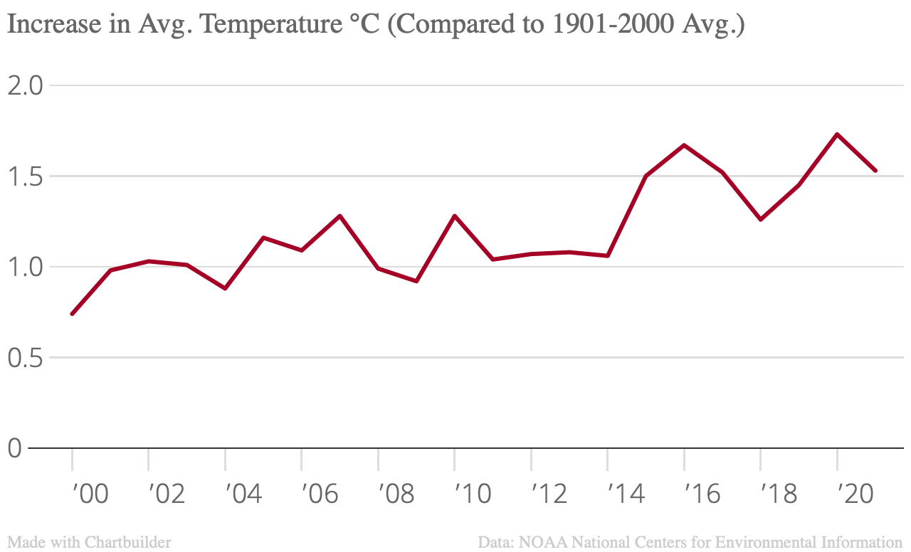

## Data Journalism Projects

<html>
  <body>
    <h1>Brendan Rego</h1>
    <h3>Lehigh University Class of 2024, Political Science and Journalism major.</h3>
    
    
    
    
I am orignially from the South Coast of Massachusetts, and I have had six family members attend Lehigh in the last two generations, including my mother, grandfather, and my aunts and uncles.

    
    
I came to Lehigh originally as a Computer Science major, but I changed course to Political Science and Journalism after one year. Those subjects are where my passion truly lies.

    
    <a href="https://www.linkedin.com/in/brendan-rego-836141191/">Check out my LinkedIn</a>
    
    
   

    
    <h3> Where do PA Senate candidates get their money? </h3>
    
    
That is the question I was attempting to answer by looking into the campaign finance data of the top Democrat and Republican candidates in the upcoming general eleciton this fall

    
    
The most jarring piece of information that I examined was that Republican candidate Dr. Mehmet Oz has donated over 12 million dollars to his own campaign, more than 75% of his total funding!

    
    
Additionally, there was a large gap in the total number of individual donors for both candidates. John Fetterman has risen a little under 6 million dollars from over 80000 individual donors. By contrast, Dr. Oz has risen over 2 million dollars from under 3000 donors. My findings point to the conclusion that although Fetterman has more individual donors than Dr. Oz, Oz is able to raise more money per donor. 

    
    
There are wide reaching implications that we can reach from my data. First, although much of Fetterman's money comes from individual donors, a large portion of it comes from various Political Action Committees that may have ultirior movites behund their funding. Secondly, Dr. Oz's ability to launch a successful campaign on the back of mostly his own money shows that financial well-being can act as both a boon and a barrier towards political power. 

    
    <a href="https://www.fec.gov/data/elections/senate/PA/2022/">Here's where I found my data</a>
    
    
    <h3>A look at campaign finance regulations over time</h3>
    
    
The following timeline shows some of the most significant campaign finance laws that have been passed in American History. While the acts that are passed and repealed are all self explanitory in isolation, there is a larger narrative that reveals itself when looking at the evolution of regulations as a whole

    
    
The history of campaign finance regulation can be seen as a history of laws that are passed by one ideological group and then subsequently repealed or deemed unconstitutional by another ideological group. In the past decade, we see that one ideological group, those opposed to any significant regulation on corporate contributions, have seemed to won the day. Since the passing of Citizens United in 2011, there has yet to be any legislative counter balance that attemps to curtail the barrage of large donations by corporations to candidates that will represent their interets at the expense of the middle and lower classes. This results in the slew of donations that can be seen when looking at my other projects on the topic.

    
  <iframe src='https://cdn.knightlab.com/libs/timeline3/latest/embed/index.html?source=1C_Tug8O6lJmLkEg62IXKDShB4FoTCJDawghzxsI6w4M&font=Default&lang=en&initial_zoom=2&height=650' width='100%' height='650' webkitallowfullscreen mozallowfullscreen allowfullscreen frameborder='0'></iframe>
    
    <h3>Bill Keating's 2022 Midterm Donation Breakdown So Far</h3>
    
    
MA09 Congressional Rep. Bill Keating has started collecting contributions for his reelection campaign coming up in the Fall. The point of interest for my analysis of his campaign contributions is whether donations have been coming mostly form individuals or from Political Action Committees.

    
    
Taking data from the Federal Election Committee's June finance breakdown, I was able to seperate Keating's donations into three categories: Individuals, PACs, and other non-political committees. This analysis revealed that while PACs have donated more money overall to the Keating Campaign, a plurality of donations are coming from individuals at smaller amounts.

    
 
    <h3>How much has the Earth warmed compared to 20th century standards</h3>
    
    
Taking a detour from the campaign finance stories that I have been focused on so far this course, for this assignment I decided to look at the average annual temperature increase from the 1901-2000 average. This idea seemed perfect for a time series graph and would be able to highlight any dangerous trends that may not be visible without data visualixation.

    
    
When taking this data from the NOAA National Centers for Environmental Information and applying it to a time series graph, there is a clear upward trend that occours. There is a significant amount of variability per year throughout the graph, but the trend reveals itself quite transparently nonetheless. It is hard to say what spefecific events caused the great variability that is especially prevelant in the second decade depicted by the graph. There is not enough data available to accurately contribute this phenomenon to global actions like the Paris Climate Accords or global pandemics like Covid-19. The only clear takeaway from this graph is that the Earth is warming, and the current century is set to be much hotter than the century that came before.

    
    

    <h3>A look at the top 10 colleges in America</h3>
    
    
This project looks at the geographic breakdown of the US News and World Report's top 10 colleges in America. I was mostly interested in seeing which region of the nation has the largest concentration of high ranking colleges.

    
    
When looking at the data, it is very clear that the Northeast has by far the highest concentration of top schools, with the West Coast being the only other section represented. Massachusetts and California are tied as the only two states with more than one college in the top 10.

    
    <iframe src="https://www.google.com/maps/d/u/0/embed?mid=100PKYNf81EBh9nkckSzz-8DdJyh5Xtg&ehbc=2E312F" width="480" height="360"></iframe>
    
    <h3>Where do Lehigh Students Prefer to attend parties?</h3>
    
    
This sample project was intended to show where students at Lehigh perfer to attend parties. What I find interesting about this data is the discrepency between male and female respondents. While female students have a clear preference for off-campus parties, male students don't have a very stong preference either way, with a slim majority prefering fraternity parties.

    
    
<noscript></noscript><object class='tableauViz'  style='display:none;'><param name='host_url' value='https%3A%2F%2Fpublic.tableau.com%2F' /> <param name='embed_code_version' value='3' /> <param name='site_root' value='' /><param name='name' value='LehighPartyLocations_16602407421840&#47;Dashboard1' /><param name='tabs' value='no' /><param name='toolbar' value='yes' /><param name='static_image' value='https:&#47;&#47;public.tableau.com&#47;static&#47;images&#47;Le&#47;LehighPartyLocations_16602407421840&#47;Dashboard1&#47;1.png' /> <param name='animate_transition' value='yes' /><param name='display_static_image' value='yes' /><param name='display_spinner' value='yes' /><param name='display_overlay' value='yes' /><param name='display_count' value='yes' /><param name='language' value='en-US' /><param name='filter' value='publish=yes' /></object>
                
    
    <h3>A look at the federal poverty line compared to the national cost of living over time</h3>
    
    
Is the poverty line high enough to be a barometer for the national cost of living? Is the poverty line increasing at a fair rate compared to the cost of living? These are the questions that I am examining for this final Tableau project in the course. I am getting my poverty line data from the Office of PLanning and Evaluation's record of Federal Register over time, and I am getting my cost of living data from the statistical analysis company Statistica's evaluation of natinoal consumer indexes per year from 1990-2020.

    
    
    
    
<noscript></noscript><object class='tableauViz'  style='display:none;'><param name='host_url' value='https%3A%2F%2Fpublic.tableau.com%2F' /> <param name='embed_code_version' value='3' /> <param name='site_root' value='' /><param name='name' value='PovertyandCostProjections&#47;PovertyandCostovertime' /><param name='tabs' value='no' /><param name='toolbar' value='yes' /><param name='static_image' value='https:&#47;&#47;public.tableau.com&#47;static&#47;images&#47;Po&#47;PovertyandCostProjections&#47;PovertyandCostovertime&#47;1.png' /> <param name='animate_transition' value='yes' /><param name='display_static_image' value='yes' /><param name='display_spinner' value='yes' /><param name='display_overlay' value='yes' /><param name='display_count' value='yes' /><param name='language' value='en-US' /><param name='filter' value='publish=yes' /></object>
                
    
  </body>
</html>
